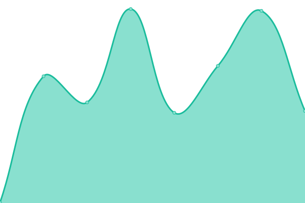

# [📈 Live Status](https://demo.upptime.js.org): <!--live status--> **🟩 All systems operational**

This repository contains the open-source uptime monitor and status page for [SFGU-ICARUS](https://sixto1982.github.io/monitoreo/), powered by [Upptime](https://github.com/upptime/upptime).

With [Upptime](https://upptime.js.org), you can get your own unlimited and free uptime monitor and status page, powered entirely by a GitHub repository. We use [Issues](https://github.com/sixto1982/monitoreo/issues) as incident reports, [Actions](https://github.com/sixto1982/monitoreo/actions) as uptime monitors, and [Pages](https://demo.upptime.js.org) for the status page.

<!--start: status pages-->
<!-- This summary is generated by Upptime (https://github.com/upptime/upptime) -->
<!-- Do not edit this manually, your changes will be overwritten -->
<!-- prettier-ignore -->
| URL | Status | History | Response Time | Uptime |
| --- | ------ | ------- | ------------- | ------ |
|  [iem-pro(front-Production)](https://www.iem-pro.cl) | 🟩 Up | [iem-pro-front-production.yml](https://github.com/Sixto1982/monitoreo/commits/HEAD/history/iem-pro-front-production.yml) | 

 332ms
     
 | 

<a href="https://Sixto1982.github.io/monitoreo/history/iem-pro-front-production">100.00%</a>
    

|  [iem-pro(back-Production)](https://backend.iem-pro.cl/) | 🟩 Up | [iem-pro-back-production.yml](https://github.com/Sixto1982/monitoreo/commits/HEAD/history/iem-pro-back-production.yml) | 

 286ms
     
 | 

<a href="https://Sixto1982.github.io/monitoreo/history/iem-pro-back-production">100.00%</a>
    

<!--end: status pages-->

[**Visit our status website →**](https://demo.upptime.js.org)

## 📄 License

- Powered by: [Upptime](https://github.com/upptime/upptime)
- Code: [MIT](./LICENSE) © [Anand Chowdhary](https://anandchowdhary.com), supported by [Pabio](https://pabio.com)
- Data in the `./history` directory: [Open Database License](https://opendatacommons.org/licenses/odbl/1-0/)
